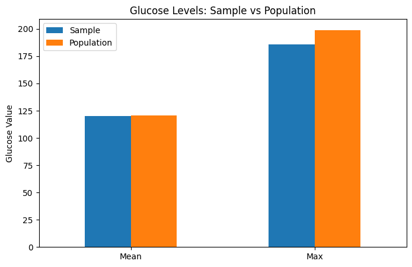
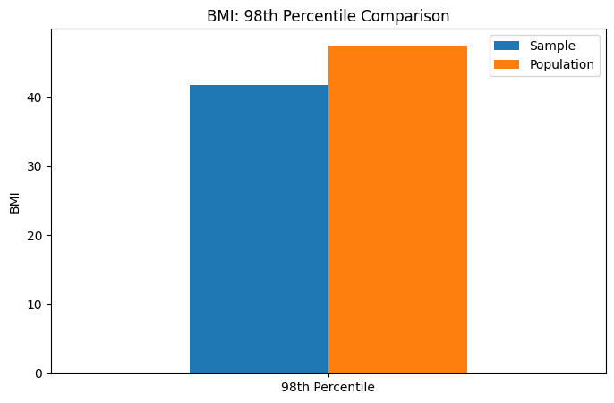
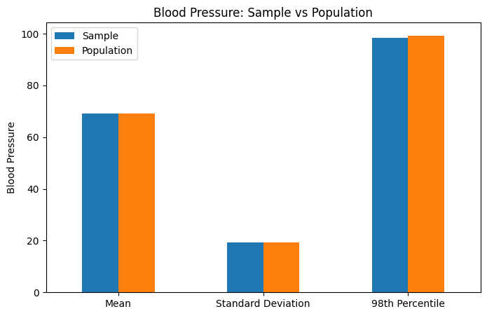

# Findings Report

## Glucose Mean and Max

### Report: 
##### Based on the graph, the sample mean and population mean for glucose values are very close, with a relative difference of 0.48%, while the sample maximum is moderately lower than the population maximum, with a relative difference of 6.53%. This indicates that the sample is a good representation of the population, effectively capturing the overall distribution and central tendency of glucose values.

## BMI 98th Percentile

### Report: 
##### This graph shows the BMI 98th percentile for both the sample and the total population. The relative difference between the sample and the population is 12.06%, indicating that the sample does not fully represent the population for extreme BMI values.

## Lunch type and average performance

### Report: 
##### This graph compares the mean, standard deviation, and 98th percentile of blood pressure between the sample and the population. The graph uses bootstrap sampling, and as a result, the relative differences are very low: 0.06% for the mean, 0.51% for the standard deviation, and 1.13% for the 98th percentile. This demonstrates that the bootstrapped sample is a very good representation of the population.
